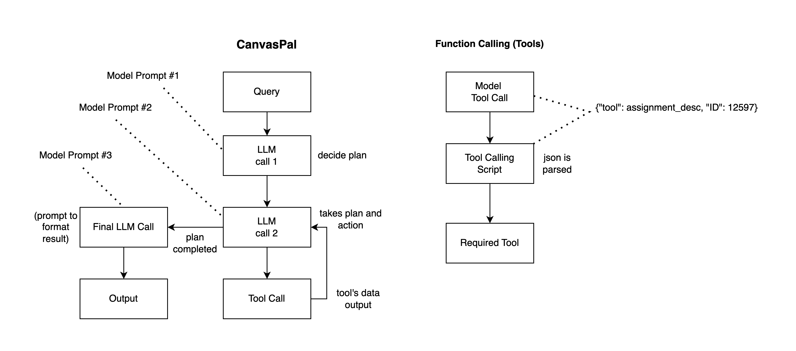

# CanvasPal

Created by Diego Ramirez, Khoa Nguyen, Lauren Kim, Patrick Higgins, Tristian Bradley, and Will Killebrew

---

CanvasPal is a Next.js + TypeScript application built for a hackathon that transforms your Canvas learning platform into an AI-driven study assistant. Leveraging Perplexity’s LLM and the Canvas API, CanvasPal can:

- **Discover** your courses, assignments, announcements, grades, and people.  
- **Plan** multi-step workflows in natural language.  
- **Execute** Canvas queries via serverless functions and a Python bridge.  
- **Summarize** results in clear, conversational prose.  
- **Theme** itself with light/dark modes powered by Tailwind CSS v4’s CSS-first configuration.  
- **Deploy** instantly on Vercel using Next.js App Router and Turbopack. (With changes to the Python runtime)

---

## 📋 Table of Contents

1. [Features](#features)
2. [Architecture Overview](#architecture-overview)
3. [Tech Stack](#tech-stack)
4. [Getting Started](#getting-started)
   - [Prerequisites](#prerequisites)
   - [Installation](#installation)
   - [Environment Variables](#environment-variables)
   - [Running Locally](#running-locally)
   - [Deployment](#deployment)
5. [Project Structure](#project-structure)
6. [How It Works](#how-it-works)
7. [Contributing](#contributing)
8. [License](#license)

---

<a id="features"></a>
## ✨ Features

- **Natural-Language Planning**  
  Auto-generate step-by-step plans (e.g. “List my unsubmitted assignments in Systems I”) via an LLM prompt.

- **Tool-Driven Execution**  
  Execute Canvas API calls through a Python bridge (`api/tool.py`), retrying until all IDs are discovered.

- **Live Streaming UI**  
  SSE (Server-Sent Events) in `route.ts` streams plan, status, steps, and final summary to the client.

- **Dark/Light Modes**  
  Seamlessly switch themes with CSS variables—no JavaScript config file needed.

- **Persistent Chat Context**  
  Stores conversation in `sessionStorage`, auto-scrolls, and supports cancellation.

- **Bring Your Own Canvas Access**  
  Deploy safely on Vercel—each user supplies their Canvas URL and API token at runtime, stored only in their browser session.

- **Extensible**  
  Easily add new Canvas tools by updating the `TOOLS` mapping in `api/tool.py`.

---

<a id="architecture-overview"></a>
## 🏛️ Architecture Overview

```
User Browser
└─▶ Next.js App (Client)
├─ Chat UI (React + Framer Motion)
└─ API Route (POST /api/chat)
├─ getPlan() → LLM (Perplexity)
├─ execStep() → LLM → { tool? | result }
├─ runTool() → Python api/tool.py → Canvas API
└─ Summary → LLM
```

---

<a id="tech-stack"></a>
## 🛠 Tech Stack

| Layer           | Technology                          |
| --------------- | ----------------------------------- |
| Framework       | Next.js 15 (App Router, Turbopack)  |
| Language        | TypeScript & Python                 |
| Styling         | Tailwind CSS v4 (CSS-first config)  |
| LLM Integration | Perplexity API (“sonar-pro” model)  |
| Canvas Bridge   | canvasapi Python library            |
| Deployment      | Vercel (serverless functions)       |

---

<a id="getting-started"></a>
## 🚀 Getting Started

<a id="prerequisites"></a>
### Prerequisites

- Node.js 20+  
- Python 3.10+  
- Vercel account (for deployment)  
- Canvas API credentials  

<a id="installation"></a>
### Installation

1. **Clone the repo**  
   ```bash
   git clone https://github.com/your-org/canvaspal.git
   cd canvaspal
   ```

2. **Install dependencies**
   ```bash
   npm install
   ```

3. **Python setup**
   ```bash
   python3 -m venv .venv
   source .venv/bin/activate
   pip install -r requirements.txt
   ```

<a id="environment-variables"></a>
### Environment Variables

Create a `.env.local` file in the project root:

```env
# Required – Groq LLM access
LLM_API_KEY=your_groq_api_key

# Optional – Canvas defaults for local development / server-side tools
CANVAS_API_URL=https://canvas.your.school
CANVAS_API_KEY=your_canvas_key

# Optional – expose defaults to the browser (use only for local dev)
NEXT_PUBLIC_CANVAS_API_URL=https://canvas.your.school
NEXT_PUBLIC_CANVAS_API_KEY=your_canvas_key

# Optional debug flag for the Python bridge
DEBUG=true
```

> On Vercel you only need `LLM_API_KEY`. CanvasPal now prompts each user for their Canvas URL and personal access token at runtime, keeping those secrets in the browser session only. If you set the optional `CANVAS_API_URL`, provide the base domain (for example `https://school.instructure.com`) without `/api/v1`. The `NEXT_PUBLIC_*` variants are bundled client-side—use them only for local development to prefill the credential form.

<a id="running-locally"></a>
### Running Locally

```bash
# Start Next.js development server
npm run dev

# In a separate shell, run the Python bridge (optional)
.venv/bin/python api/tool.py
```

Visit <http://localhost:3000> to try it out.

When the UI loads, click **Add credentials** (top bar) to provide your Canvas base URL (for example `https://school.instructure.com`, without `/api/v1`) and personal access token if you didn’t set them in `.env.local`.

<a id="deployment"></a>
### Deployment

1. Push to GitHub.
2. Connect your repo to Vercel and select `main` (or your release branch).
3. In **Project Settings → Environment Variables**, add `LLM_API_KEY` with your Groq API token (other keys are optional).
4. Deploy. Each visitor enters their own Canvas URL/API token via the in-app credentials dialog, so no Canvas secrets live on the server.

---

<a id="project-structure"></a>
## 📁 Project Structure

```
canvas-pal/
├── api/                # Serverless Canvas API tooling (Python)
├── public/             # Static assets served by Next.js
├── src/                # App Router routes, components, and styles
├── requirements.txt    # Python dependencies for the Canvas bridge
├── package.json        # Node.js dependencies and scripts
├── LICENSE             # MIT license for CanvasPal
└── README.md           # Project overview and setup guide
```

---

<a id="how-it-works"></a>
## 🔍 How It Works

1. **Client** sends chat history + user query to `/api/chat`.
2. **Server** streams SSE events:
    - **plan**: JSON array of steps from the LLM.
    - **status**: current action.
    - **step**: each completed step.
    - **summary**: final conversational reply.
3. **Execution** of Canvas API calls happens via the Python bridge (`api/tool.py`).

---

<a id="contributing"></a>
## 🤝 Contributing

1. Fork & create a branch:
   ```bash
   git checkout -b feature/my-new-tool
   ```
2. Implement your feature or fix.
3. Add tests/documentation if needed.
4. Open a pull request against `main`.

---

<a id="license"></a>
## 📄 License

CanvasPal is released under the [MIT License](LICENSE). Review the license for details on permissions, conditions, and limitations.

---

*Happy studying with CanvasPal!* 🚀
